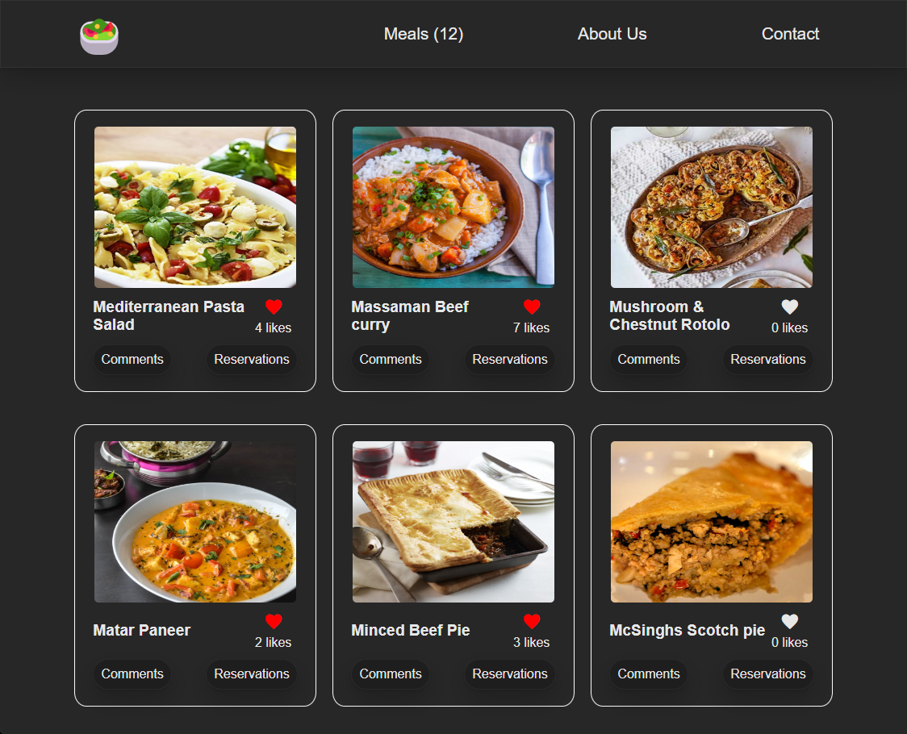

   <h1><b>Awesome Meals</b></h1>
  

<!-- TABLE OF CONTENTS -->

# 📗 Table of Contents

- [📖 About the Project](#about-project)
  - [🛠 Built With](#built-with)
    - [Tech Stack](#tech-stack)
    - [Key Features](#key-features)
  - [🚀 Live Demo](#live-demo)
- [💻 Getting Started](#getting-started)
  - [Setup](#setup)
  - [Prerequisites](#prerequisites)
  - [Install](#install)
  - [Usage](#usage)
  - [Run tests](#run-tests)
  - [Deployment](#triangular_flag_on_post-deployment)
- [👥 Authors](#authors)
- [🔭 Future Features](#future-features)
- [🤝 Contributing](#contributing)
- [⭐️ Show your support](#support)
- [🙏 Acknowledgements](#acknowledgements)
- [❓ FAQ (OPTIONAL)](#faq)
- [📝 License](#license)

<!-- PROJECT DESCRIPTION -->

# 📖 Awesome Meals 

**Awesome Meals** is an API based webapp where the user can see, like, comment and reserve their favorite meals.

## 🛠 Built With 

### Tech Stack 

  
Client

  <ul>
    <li><a href="https://www.javascript.com/">JavaScript</a></li>
  </ul>
  <ul>
    <li><a href="https://html.com/">Html</a></li>
  </ul>
  <ul>
    <li><a href="hhttps://www.w3schools.com/css/">CSS</a></li>
  </ul>

  
Server

  <ul>
    <li><a href="https://www.notion.so/Involvement-API-869e60b5ad104603aa6db59e08150270">Involvement API</a></li>
    <li><a href="https://www.themealdb.com/api.php">MealsDB API</a></li>
  </ul>

Database

  <ul>
    <li>N/A</li>
  </ul>

<!-- Features -->

### Key Features 

- **Awesome Meals allows the user to see their favorite meals in an interactive way**
- **Awesome Meals allows the user to like their favorite meals and check the most liked meals**
- **Awesome Meals allows the user to comment and check all comments for any meal**
- **Awesome Meals allows the user to reserve and check all reservations for any meal**

(<a href="#readme-top">back to top</a>)

<!-- LIVE DEMO -->

## 🚀 Live Demo 

- [Not Available](https://jmonto55.github.io/ToDoList/dist/)

(<a href="#readme-top">back to top</a>)

<!-- GETTING STARTED -->

## 💻 Getting Started 

To get a local copy up and running, follow these steps.

### Prerequisites

In order to run this project you need:
- A working computer.
- Connection to internet.

### Setup

To get a local copy up and running follow these simple example steps.

- Go to this link https://github.com/jmonto55/javascript_api_based_webapp
- In your command terminal go to the directory where you want to clone the repository.
- Write `git clone https://github.com/jmonto55/javascript_api_based_webapp.git`
- Go to the repository folder in your command terminal using `cd 
javascript_api_based_webapp
`.
- Run `code .` to open a local copy of the project in your code editor.

### Install

- Run `npm install` to install all dev dependencies for Linters, Webpack, Jest & Babel.

### Usage

To run the project, execute the following command:

- Run `npm run start` in your command terminal.

(<a href="#readme-top">back to top</a>)

<!-- AUTHORS -->

## 👥 Authors 

👤 **Gueleu Farida**

- GitHub: [@SFarida](https://github.com/SFarida)

👤 **Sajib Arafat Siddiqui**

- GitHub: [@sajibarafatsiddiqui](https://github.com/sajibarafatsiddiqui)

👤 **Jose Montoya**

- GitHub: [@jmonto55](https://github.com/jmonto55)

(<a href="#readme-top">back to top</a>)

<!-- FUTURE FEATURES -->

## 🔭 Future Features 

- [ ] **Cool styles will be added in the future**

(<a href="#readme-top">back to top</a>)

<!-- CONTRIBUTING -->

## 🤝 Contributing 

Contributions, issues, and feature requests are welcome!

Feel free to check the [issues page](../../issues/).

(<a href="#readme-top">back to top</a>)

<!-- SUPPORT -->

## ⭐️ Show your support 

If you like this project feel free to frok it and use it as you need.

(<a href="#readme-top">back to top</a>)

<!-- ACKNOWLEDGEMENTS -->

## 🙏 Acknowledgments 

I would like to thank Microverse for the information provided to build this project.

(<a href="#readme-top">back to top</a>)

<!-- FAQ (optional) -->

## ❓ FAQ (OPTIONAL) 

- **Can I use the project for any purpose?**

  - Yes, you can use this files for anything you need.

- **Is the information saved in any database?**

  - No, all data is saved in Local Storage.

(<a href="#readme-top">back to top</a>)

<!-- LICENSE -->

## 📝 License 

This project is [MIT](./LICENSE) licensed.

(<a href="#readme-top">back to top</a>)

